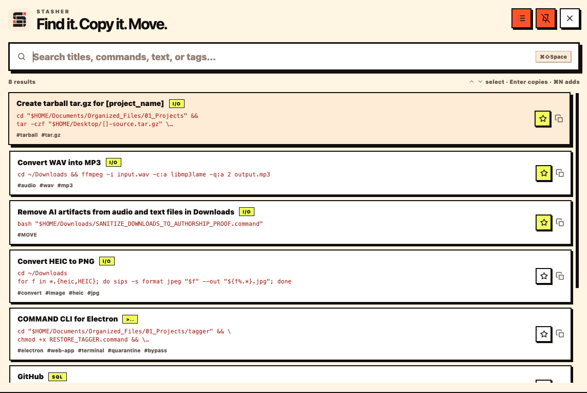
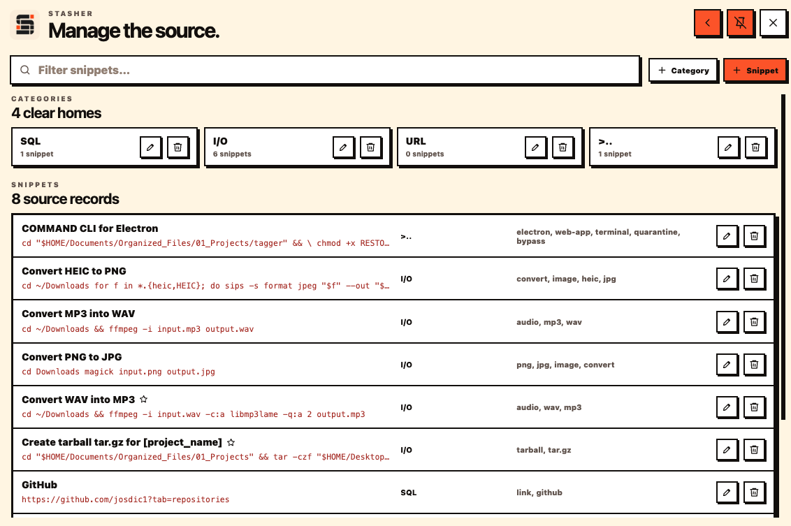

<div align="center">

# Stasher

### Find it. Copy it. Move.

A searchable home for commands, links, and reusable text.

</div>

<p align="center">
  
</p>

## Overview

Stasher keeps commands, links, and reusable text in one place. Search by title, command, content, or tag, copy the result, and get back to work.

## Features

- Fast search across titles, commands, text, and tags
- One-click copy to the system clipboard
- Favorites for frequently used entries
- Categories and tags for clean organization
- Separate source-management view for adding and editing records

## How it works

1. Search in plain language.
2. Copy the command or text you need.
3. Manage categories and snippets only when the source changes.

<p align="center">
  
</p>

## Built with

Electron · React · TypeScript · Vite · Clipboard IPC

## Run locally

```bash
npm install
npm run dev
```

## Privacy

No account. The library is stored locally.
